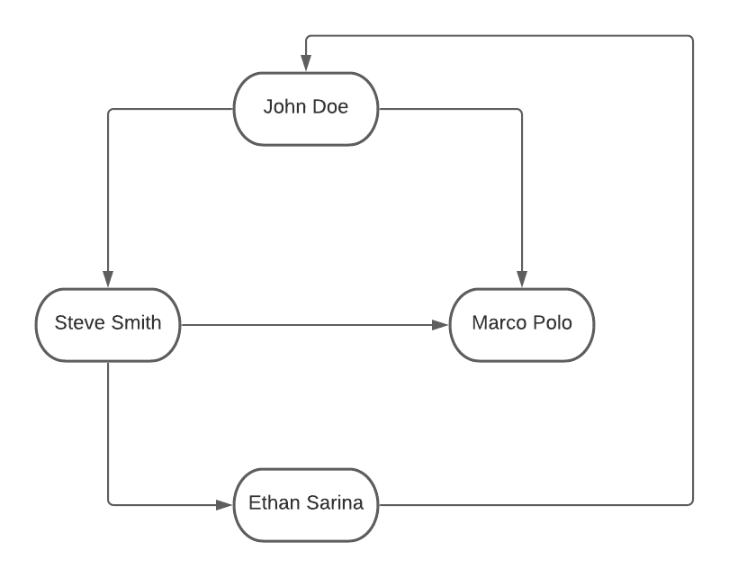
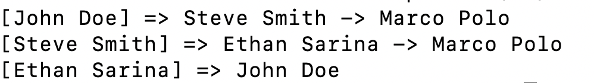

## Directed Graph
Implementation of a Directed Generic Graph where user can add generic vertices and add connection between vertices. The graph is designed and represented by <b>Adjacency List</b>. 

### What to expect
Graph that has been implemented 



<br/><br/>

The program produces below output



## Dependency
* gcc/g++ >= 7.4.0
  * Linux: gcc / g++ is installed by default on most Linux distros
  * Mac: same instructions as make - [install Xcode command line tools](https://developer.apple.com/xcode/features/)
  * Windows: recommend using [MinGW](http://www.mingw.org/)

## Instruction to run
Compile the project by below command
```
g++ -std=c++11 main.cpp graph.cpp linked_list.cpp
```
An executable `a.out` will be generated in the root directory. Run that by below command
```
./a.out
```  