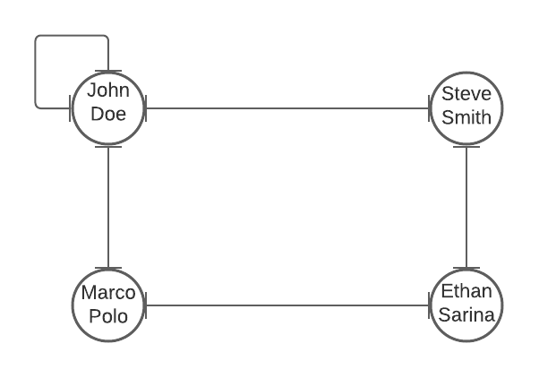
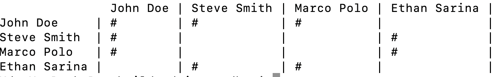

## Undirected Graph
Implementation of an Undirected Generic Graph where user can add generic vertices and add/remove connection between vertices. The graph is designed and represented by <b>Adjacency Matrix</b>. 

### What to expect
Graph that has been implemented 



<br/><br/>

The program produces below output



## Dependency
* cmake >= 3.11.3
  * All OSes: [click here for installation instructions](https://cmake.org/install/)
* make >= 4.1 (Linux, Mac), 3.81 (Windows)
  * Linux: make is installed by default on most Linux distros
  * Mac: [install Xcode command line tools to get make](https://developer.apple.com/xcode/features/)
  * Windows: [Click here for installation instructions](http://gnuwin32.sourceforge.net/packages/make.htm)
* gcc/g++ >= 7.4.0
  * Linux: gcc / g++ is installed by default on most Linux distros
  * Mac: same instructions as make - [install Xcode command line tools](https://developer.apple.com/xcode/features/)
  * Windows: recommend using [MinGW](http://www.mingw.org/)

## Instruction to run
To compile the project, first, create a `build` directory and change to that directory:
```
mkdir build && cd build
```
From within the `build` directory, then run `cmake` and `make` as follows:
```
cmake ..
make
```
### Running
The executable will be placed in the `build` directory. From within `build`, you can run the project as follows:
```
./undirected_graph
```

